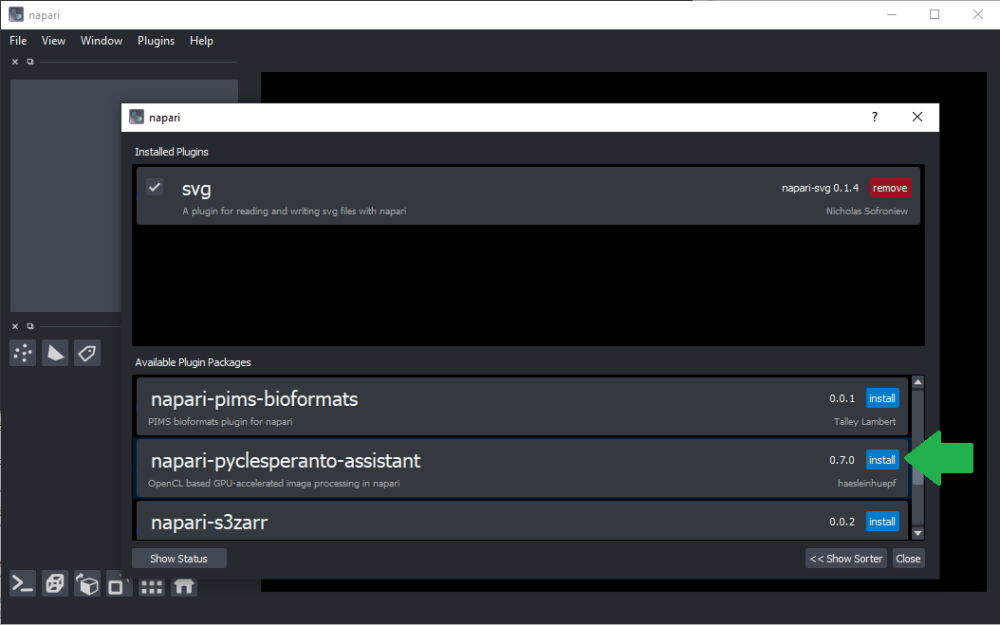
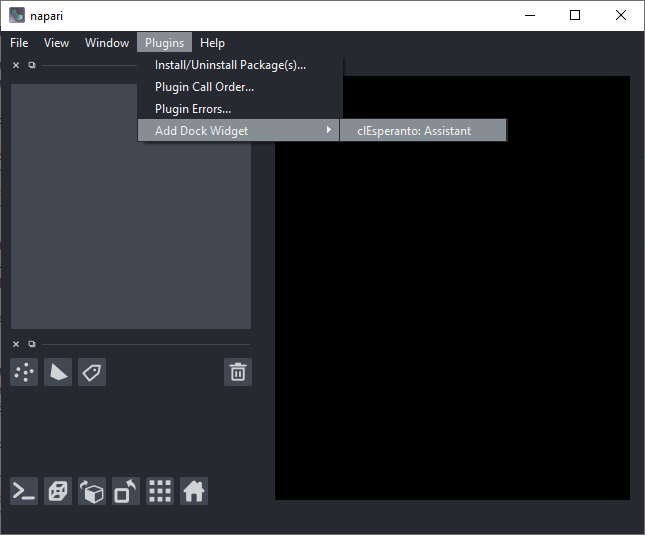
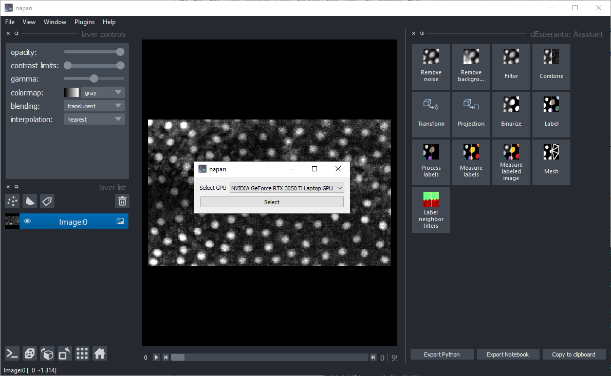
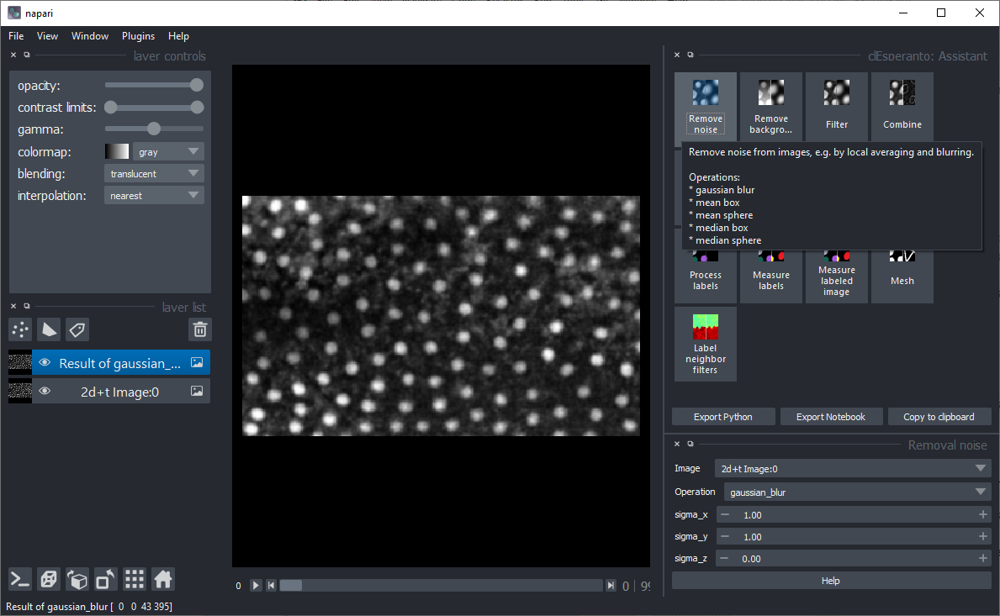
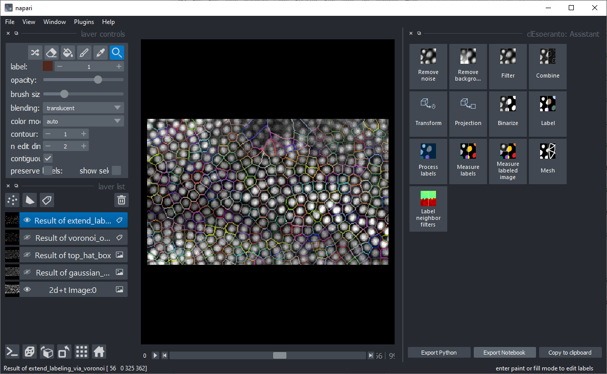

# napari-pyclesperanto-assistant
[](https://forum.image.sc/tag/clesperanto)
[](http://clesperanto.net)
[](https://github.com/haesleinhuepf/napari-pyclesperanto-assistant/raw/master/LICENSE)
[](https://pypi.org/project/napari-pyclesperanto-assistant)
[](https://python.org)
[](https://github.com/clesperanto/napari_pyclesperanto_assistant/actions)
[](https://codecov.io/gh/clesperanto/napari_pyclesperanto_assistant)

The py-clEsperanto-assistant is a yet experimental [napari](https://github.com/napari/napari) plugin for building GPU-accelerated image processing workflows. 
It is part of the [clEsperanto](http://clesperanto.net) project.
It uses [pyclesperanto](https://github.com/clEsperanto/pyclesperanto_prototype) and with that [pyopencl](https://documen.tician.de/pyopencl/) as backend for processing images.
This plugin was generated with [Cookiecutter](https://github.com/audreyr/cookiecutter) using with napari's [cookiecutter-napari-plugin](https://github.com/napari/cookiecutter-napari-plugin) template.


## Installation
### Installation using the napari installer

Download and install [napari](https://github.com/napari/napari/releases/tag/v0.4.3).

Windows users please download [pyopencl...cl12-cp38-cp38-win_amd64.whl](https://www.lfd.uci.edu/~gohlke/pythonlibs/#pyopencl). Use the command line to navigate to the folder where you downloaded it (for example the Downloads folder using `cd Downloads`). From there, run the following line after replacing `<username>` with your username:
```
C:\Users\<username>\AppData\Local\Programs\napari\python\python.exe -m pip install pyopencl-2020.2.2+cl12-cp38-cp38-win_amd64.whl
```

Start napari and navigate to its menu `Plugins > Install/Uninstall Package(s)...`. Select `napari-pyclesperanto-assitant` from the list and install it by clicking the blue button on the right:


Restart napari. Afterwards, you should find the Assistant in the plugins menu:



### Installation via conda and pip
If you have no python/conda environment installed yet, please follow the instructions [here](https://mpicbg-scicomp.github.io/ipf_howtoguides/guides/Python_Conda_Environments) first.

Download and install `pyopencl` via `conda`, and `napari` and the `napari-pyclesperanto-assistant` uing `pip`. Windows users can aternatively follow the instructions in the section below in case of trouble.

```
conda install -c conda-forge pyopencl
pip install napari[all]
pip install napari-pyclesperanto-assistant
```

Afterwards, you can start the assistant using the following command. Replace the url with an image file of your choice:
```
python -m napari_pyclesperanto_assistant https://github.com/clEsperanto/napari_pyclesperanto_assistant/raw/master/napari_pyclesperanto_assistant/data/CalibZAPWfixed_000154_max-16.tif
```

### Installation on windows
On windows some additional steps are necessary. Download a pre-compiled wheel of [pyopencl](https://documen.tician.de/pyopencl/) e.g. from [here](https://www.lfd.uci.edu/~gohlke/pythonlibs/#pyopencl). 
It is recommended to install `pyopencl-...+cl12-cp38-cp38-win_amd64` - the `cl12` and `cp38` are important when choosing the right download. They stand for OpenCL 1.2 and Python 3.8.

Enter the correct pyopencl filename and execute this from the command line:
```
pip install pyopencl-2020.3.1+cl12-cp38-cp38-win_amd64.whl
```

In case napari doesn't start up with an error mentioning numpy ([see also](https://github.com/napari/napari/issues/2022)), execute this from the command line:
```
pip install numpy==1.19.3
```

## Usage
This short tutorial demonstrates how to generate code using the pyclersperanto-assistant. 

<iframe src="docs/images/pyclesperanto_assistant_screencast.mp4" width="600" height="300"></iframe>
[Download workflow as video](docs/images/pyclesperanto_assistant_screencast.mp4)

### Start up the assistant
Open a command line and start up the assistant and pass the image file you want to process. The shown example image can be found [online](https://github.com/clEsperanto/napari_pyclesperanto_assistant/blob/master/napari_pyclesperanto_assistant/data/CalibZAPWfixed_000154_max-16.tif)

```
python -m napari_pyclesperanto_assistant C:\structure\code\napari_pyclesperanto_assistant\napari_pyclesperanto_assistant\data\CalibZAPWfixed_000154_max-16.tif
```

Alternatively, you can attach the assistant to your napari from within your python code like this:
```
import napari

# create Qt GUI context
with napari.gui_qt():
    # start napari
    viewer = napari.Viewer()

    # attach the assistant
    import napari_pyclesperanto_assistant
    napari_pyclesperanto_assistant.napari_plugin(viewer)
```

napari will open with the assistant activated:



### Set up a workflow

Choose categories of operations in the top right panel, for example start with denoising using a Gaussian Blur with sigma 1 in x and y:



Choose more processing steps. Note: You can change the input image/layer for each operation, the operation and its parameters in the bottom right panel.
For example, continue with these steps
* Filter (Background Removal): Top hat, radius 5 in x and y
* Binarization: Threshold Otsu
* Label: Voronoi labeling 
* Map: Touching neighbor count map
* Binarization: Detect label edges, with the result from the second last step as input.

Hide some layers showing intermediate results. Switch the bleinding of the final result layer to "additive" to see through it on the original image.



### Code generation
In the plugins menu, you find two entries which allow you to export your workflow as Python/Jython code.


Export your workflow as Jupyter notebook. Start the notebook from the command line using
```
jupyter notebook my_notebook.ipynb
```


Alternatively, export the workflow as Jython/Python script. This script can be executed from the command line like this
```
python my_script.py
```

It can also be executed in Fiji, in case the [CLIJx-assistant is installed](https://clij.github.io/assistant/installation).


Note: Depeending on which layers were visible while exporting the code, different code is exported. 
Only visible layers are shown. 
Change layer visibility and export the script again. 
If Fiji asks you if it should reload the script file, click on "Reload".


## For developers

Getting the recent code from github and locally installing it
```
git clone https://github.com/clesperanto/napari_pyclesperanto_assistant.git

pip install -e ./napari_pyclesperanto_assistant
```

Optional: Also install pyclesperantos recent source code from github:
```
git clone https://github.com/clEsperanto/pyclesperanto_prototype.git

pip install -e ./pyclesperanto_prototype
```

Starting up napari with the pyclesperanto assistant installed:
```
ipython --gui=qt napari_pyclesperanto_assistant\napari_pyclesperanto_assistant
```


## Feedback welcome!
clEsperanto is developed in the open because we believe in the open source community. See our [community guidelines](https://clij.github.io/clij2-docs/community_guidelines). Feel free to drop feedback as [github issue](https://github.com/clEsperanto/pyclesperanto_prototype/issues) or via [image.sc](https://image.sc)

[Imprint](https://clesperanto.github.io/imprint)
